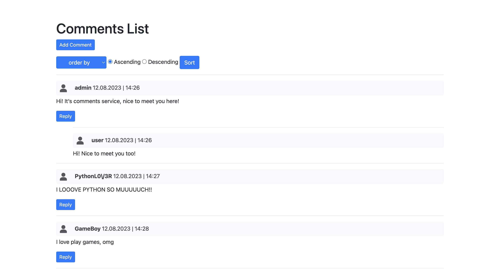

# dZENcomments
Service for comments

## Features

- Creating comments
- Making replies for comments
- Captcha for creating
- Sorting by username/email/created time for asc or desc

## Demo




## Installing using GitHub:
1. Clone the repository:

```bash
git clone https://github.com/your-username/dZENcomments
```
2. Change to the project's directory:
```bash
cd dZENcomments
```

3. Once you're in the desired directory, run the following command to create a virtual environment:
```bash
python -m venv venv
```

4. Activate the virtual environment:

On macOS and Linux:

```bash
source venv/bin/activate
```
On Windows:
```bash
venv\Scripts\activate
```

5. Install the dependencies

```bash
pip install -r requirements.txt
```

6. Set up the database:

Run the migrations

```bash
python manage.py migrate
```

Load fixture

```bash
python manage.py loaddata fixture_data.json
```

7. Start the development server

```bash
python manage.py runserver
```
8. Access the website locally at http://localhost:8000.

## Run with Docker

Docker should be installed

```bash
docker-compose build
```
```bash
docker-compose up
```
